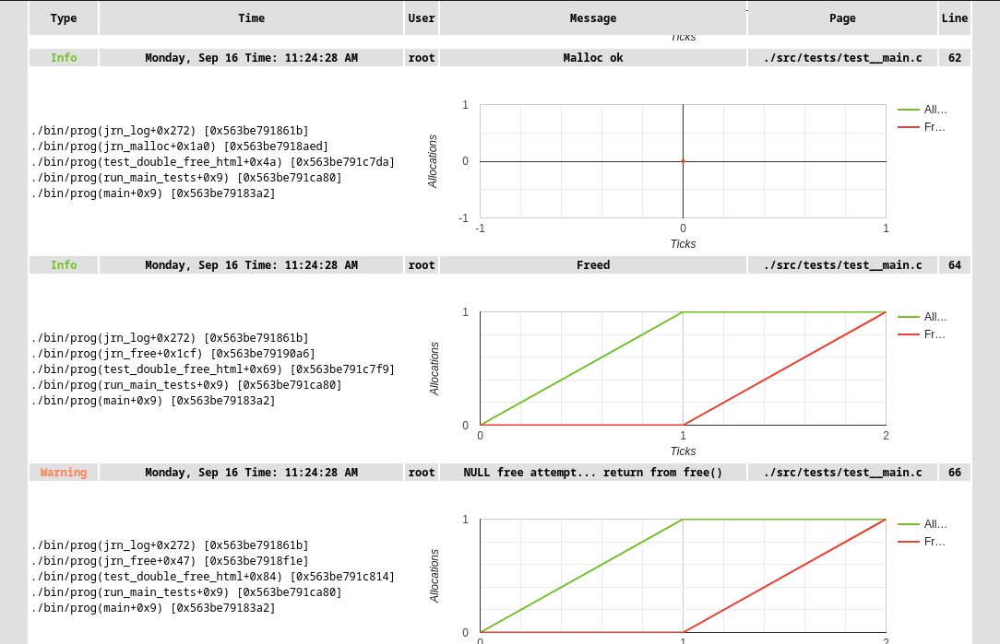

## Journey log lib 

1. wrappers for 
* calloc
* malloc
* realloc
* free

locks if mutex is passed

2. outputs memory stats, allocations and frees

3. for the log type uses
* jrn_debug();
* jrn_info();
* jrn_error();
* jrn_warning(); 

4. stacktraces up to limit

5. outputs to
* html
* json
* text
* terminal *if stream is set to true

6. can be initialized and destoryed multiple times with different settings

example usage:
* creates log in  ./log folder for the file log.json
* records everything from debug level and up
* terminal stream


```c

jrn_init("log", "log", LOG_LEVEL_DEBUG, LOG_FILE_JSON, true);

...

jrn_destroy();


```


### Journey init function

```c
void 
jrn_init(const char *logfolder_name, 
        const char *basefile_name, 
        jrn_level_t level, 
        jrn_file_type_t filetype,
        bool is_streaming);

void jrn_destory(void);

/*
shuts down everything journey related. mainly destroys the only dynamicly allocated part which is jrn_memory_t  
*/
```

1. logfolder_name name of the folder where you would like to store   your log eg: log; test_log etc, WARNING: only relative path is accepted
2. basefile_name  base filename for the log file eg: log; special-log etc
3. level: 
* LOG_LEVEL_DEBUG
* LOG_LEVEL_INFO
* LOG_LEVEL_WARNING
* LOG_LEVEL_ERROR

4. filetype -- specific log format select from: 
* LOG_FILE_TEXT
* LOG_FILE_JSON
* LOG_FILE_HTML
* LOG_FILE_CSV (!) NOT IMPL
* LOG_FILE_SQLITE (!) NOT IMPL
5. is_streaming -- will log everything in a terminal

### Mutex

You can pass mutex to the programm at any moment, detach it if it's not needed, since all memory allocations are locking, if mutex exists
in jrn_settings

```c
void jrn_mutex_attach(void * mutex);
void jrn_mutex_detach(void);

```

Mutex locking mechanism is encapsulated in 

JRN_MUTEX_LOCK and 

JRN_MUTEX_UNLOCK macro. 

Found at jrn_framerok.h


### Notes on HTML templates
The HTML template uses Google Javascript Graph, which is pretty heavy for the large amount of records, so memory ticks are limited to the last 50 records; change the limit if you need to.

```c
//jrn_memory.h
...
#define JRN_MEM_GRAPH_LIMIT 50U
...
```

If you do change the limit, however, the JRN_BUF, which is used for the record, might overflow, so change that too.

```c
//jrn_framework.h
...
#define JRN_BUF 4096U
...
```

Html template, edit style in ./html/style.css




### Notes on JSON template

General output for the JSON template

```JSON
[
    {
        "uuid": "f0bb79d1-54c4-43e6-8784-ec26d91fb5da",
        "type": "Info",
        "time": "Monday, Sep 16 Time: 07:03:35 AM",
        "user": "user",
        "message": "Malloc ok ",
        "file": "./src/tests/test__main.c",
        "line": 57,
        "stack": [
            "./bin/prog(jrn_log+0x239) [0x559eb85be5e2]",
            "./bin/prog(jrn_malloc+0x1a0) [0x559eb85bea6d]",
            "./bin/prog(test_init+0x19d) [0x559eb85c245a]",
            "./bin/prog(run_main_tests+0x9) [0x559eb85c2516]",
            "./bin/prog(main+0x9) [0x559eb85be3a2]"
        ],
        "memory_ticks": [
            [
                236,
                135,
                101
            ],
     
            // n - 2 memory ticks
            [
                285,
                184,
                101
            ]
        ]
    }
    ]

```
